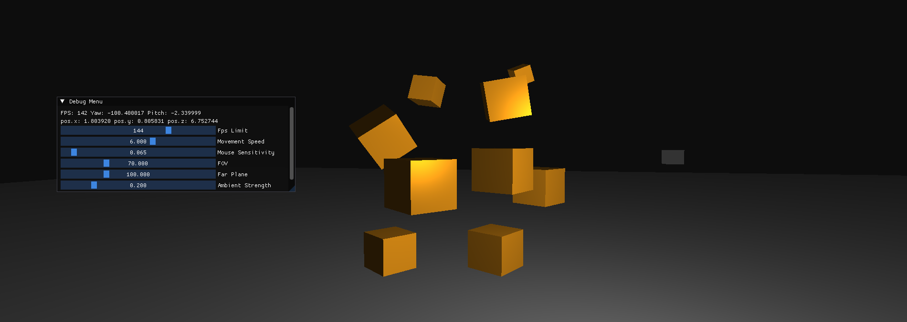

# GameGen Engine  🤖

 

GameGen Engine — это самодельный игровой движок, сделанный на основе материала с [learnopengl.com](learnopengl.com) и абстрагированный с помощью классов. Он включает в себя современные технологии визуализации, управление камерой и интерфейс отладки с использованием ImGui.

---

## Основные возможности
- **Освещение**: поддержка точечных источников света, регулируемая сила окружающего освещения.
- **Интерфейс отладки**: возможность изменять параметры сцены в реальном времени с помощью ImGui.
- **Функционал**: создание своих сцен происходит с помощью использования заголовочных файлов в папке `include` 

**Используемые технологии**:
  - GLAD (v0.1.34)
  - GLFW (v3.4)
  - GLM (v4.2)
  - ImGui (v1.91.6)
  - STB (v2.28)

---

## Тестовая сцена
В файле `main.cpp` представлена тестовая сцена, сделанная на основе *GameGen*

### Управление:
- **W, A, S, D** — перемещение камеры.
- **Shift** — ускорение.
- **F** — показать/скрыть курсор мыши.
- **Esc** — закрыть приложение.
- **Левая кнопка мыши** - привязать световой куб к камере
- **Правая кнопка мыши** - отвязать куб / удерживать куб рядом

На сцене есть:
1. Вращающиеся кубы.
2. Световой куб, который можно привязать к камере.
3. Платформа для дополнительного восприятия глубины.

Код поддерживает масштабируемость — добавление новых объектов или световых источников требует минимальных изменений.

---

## Компиляция проекта
Для компиляции GameGen Engine используется **CMake**.

### Шаги сборки:
1. Убедитесь, что у вас установлен **CMake** (минимальная версия 3.10).
2. Склонируйте репозиторий с исходным кодом.
3. перейдите в папку `build`:
   ```bash
   cd build
   ```
4. Запустите CMake для генерации файлов сборки:
   ```bash
   cmake .. -G Ninja
   ```
5. Соберите проект:
   ```bash
   cmake --build .
   ```
6. Запустите исполняемый файл `app`, который будет находиться в папке сборки.
    ```bash
    ./app
    ```


## Технические детали
- **Рендеринг моделей**: Модели отображаются с использованием буферов OpenGL и шейдерной программы.
- **Камера**: Реализована на основе библиотеки GLM, поддерживает изменения FOV и Far Plane.


## Лицензия
[MIT License](LICENSE.txt) — свободное использование, изменение и распространение проекта.

